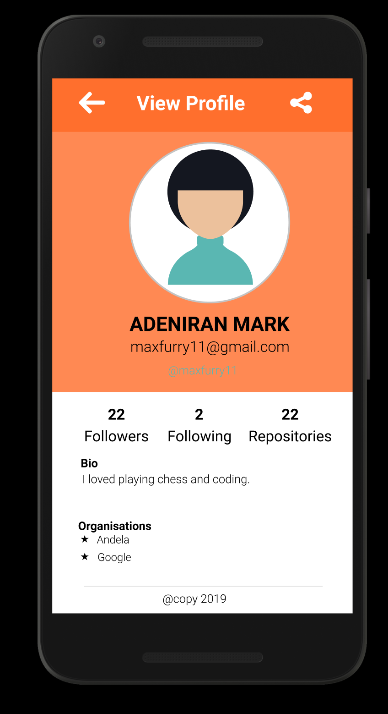

# JAVA GITHUB USERS IN NAIROBI MOBILE APP

## Getting Started
Below are instructions to get the app good to run on your local machine.

### Prerequisites
* Android Studio
* JDK
* Git

### Installing
* clone the repo : git clone https://github.com/Maxfurry/Java-Devs-Nairobi.git
* import the project into android studio
* Create an android virtual device (AVD) if you do not have one already
* Run the project 

### Wireframes

